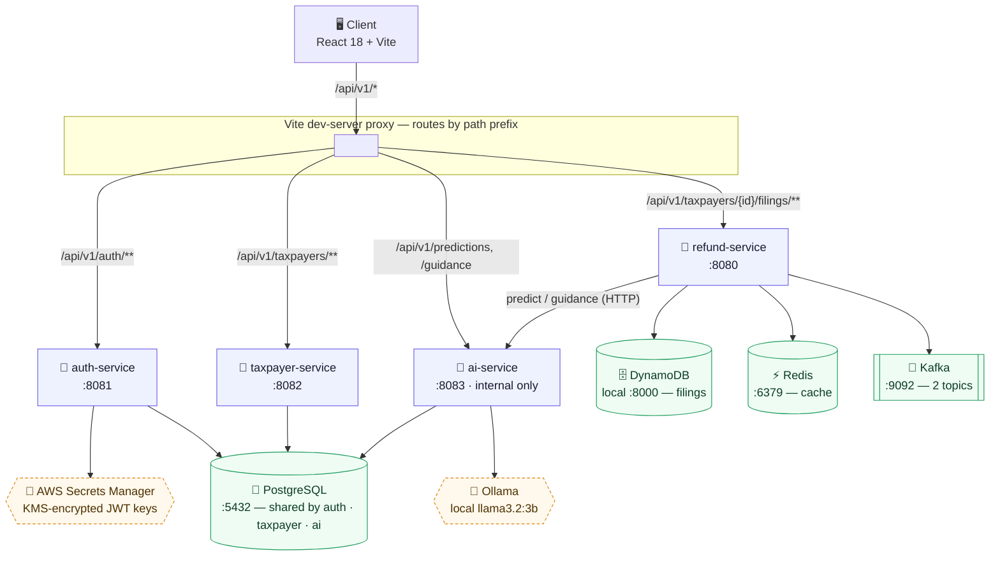

# TurboTax Refund Platform

A microservices demo platform for tracking a taxpayer's refund journey — filing, IRS status
updates, ML-assisted refund-timing predictions, and RAG-backed guidance when a refund is
flagged, under review, or already on its way.

4 Spring Boot services, a React SPA, and full distributed tracing across the request path.

## Architecture



> Rendered natively by GitHub on this page and in the [Wiki](../../wiki) — no external image
> hosting required. Source: this fenced ` ```mermaid ` block, editable in place.

**There is no API gateway.** In development, Vite's dev-server proxies each path prefix to the
right service on `localhost`; in a real deployment this would be a reverse proxy / gateway
tier, but none exists in this repo today. See [Trade-offs](docs/) for the full list of
what's real vs. simplified.

| Service | Port | Owns | Depends on |
|---|---|---|---|
| **auth-service** | 8081 | `users` (Postgres) | AWS Secrets Manager (JWT keys, KMS-encrypted) |
| **taxpayer-service** | 8082 | `taxpayers`, `user_taxpayer_access` (Postgres) | auth-service (JWT validation) |
| **refund-service** | 8080 | Filings (DynamoDB), cache (Redis), events (Kafka) | taxpayer-service, ai-service |
| **ai-service** | 8083 | Refund guidance corpus + pgvector (Postgres) | Ollama (narrative generation) |

## Getting started

```bash
# infra: Postgres+pgvector, Redis, Kafka, DynamoDB Local, Prometheus, Grafana, Jaeger
docker compose up -d

# each service (separate terminals, or run/debug from your IDE)
./gradlew :auth-service:bootRun
./gradlew :taxpayer-service:bootRun
./gradlew :refund-service:bootRun
./gradlew :ai-service:bootRun

# frontend
npm --prefix frontend run dev
```

Frontend: http://localhost:5173 · Jaeger UI: http://localhost:16686 · Grafana: http://localhost:3000

## Testing

```bash
./gradlew test                          # JUnit, all 4 services — 98% JaCoCo coverage gate
npm --prefix frontend run test:e2e      # Playwright E2E
```

## Observability

Every service emits Prometheus metrics, structured logs correlated by trace ID, and OTLP
traces to Jaeger — end to end across a single request, not just per-service.

## Design docs

- [`docs/ai-refund-prediction-scope.md`](docs/ai-refund-prediction-scope.md) — AI prediction & RAG guidance design
- [`refund-rag-kb/README.md`](refund-rag-kb/README.md) — RAG knowledge base corpus notes
- Full High-Level Design (data model, request flow, trade-offs, scale) — see the project [Wiki](../../wiki)
