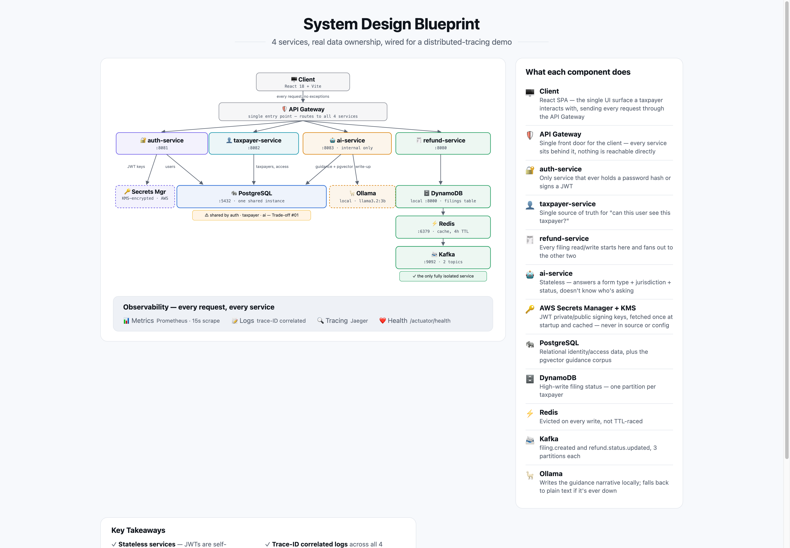
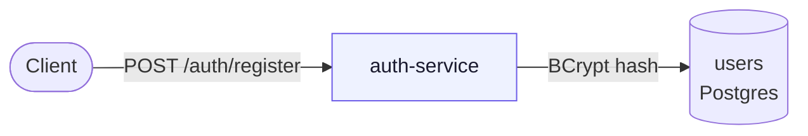
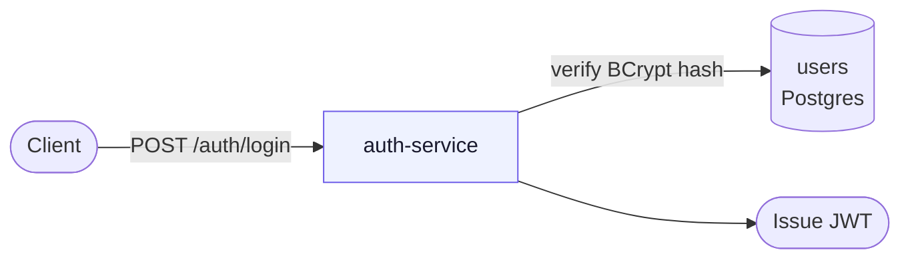
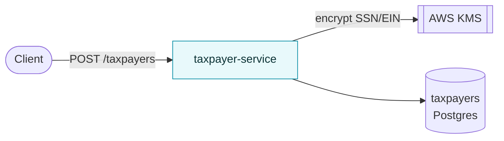
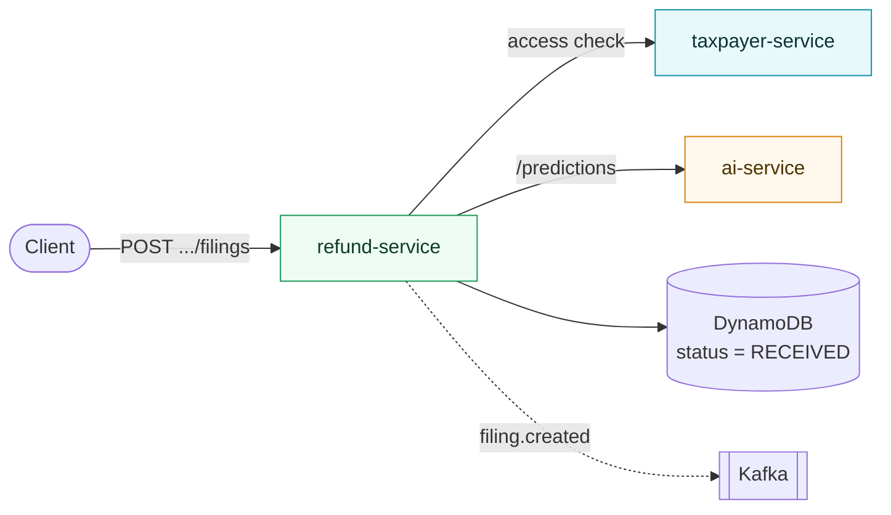
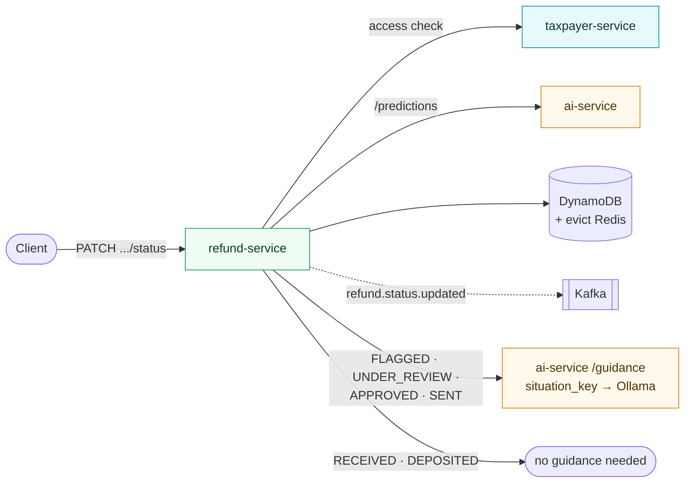

# TurboTax Refund Platform

A microservices demo platform for tracking a taxpayer's refund journey — filing, IRS status
updates, ML-assisted refund-timing predictions, and RAG-backed guidance when a refund is
flagged, under review, or already on its way.

4 Spring Boot services, a React SPA, and full distributed tracing across the request path.

## Architecture

[](docs/images/architecture-demo.png)

*Click the diagram to open it full-size (GitHub caps inline README images to the column width — this opens the raw, full-resolution PNG instead).*

> Simplified for presentation — the "API Gateway" box is illustrative. In this repo, Vite's
> dev-server proxy is what actually routes each path prefix to its service on `localhost`;
> there is no real gateway tier yet. See [Trade-offs](docs/) for the full list of what's real
> vs. simplified.

| Service | Port | Owns | Depends on |
|---|---|---|---|
| [**auth-service**](auth-service/README.md) | 8081 | `users` (Postgres) | AWS Secrets Manager (JWT keys, KMS-encrypted) |
| [**taxpayer-service**](taxpayer-service/README.md) | 8082 | `taxpayers`, `user_taxpayer_access` (Postgres) | auth-service (JWT validation) |
| [**refund-service**](refund-service/README.md) | 8080 | Filings (DynamoDB), cache (Redis), events (Kafka) | taxpayer-service, ai-service |
| [**ai-service**](ai-service/README.md) | 8083 | Refund guidance corpus + pgvector (Postgres) | Ollama (narrative generation) |
| [**frontend**](frontend/README.md) | 5173 | — (stateless SPA) | all 4 services, via the Vite dev proxy |

Each service has its own README with its API, config keys, and how to run/test it standalone.

## End-to-end flow

The full journey from a new user to a deposited refund, broken into one small diagram per
step rather than one large connected graph — auth first, then the taxpayer/filing lifecycle.
See [API workflows](#api-workflows) below for the granular steps behind each box.

### Auth

**Flow 1 — Register**


```mermaid
flowchart LR
    C(["Client"]) -->|"POST /auth/register"| A["auth-service"]
    A -->|"BCrypt hash"| D[("users<br/>Postgres")]
    classDef auth fill:#eef2ff,stroke:#6d5ce8,color:#1a1a2e;
    class A auth;
```

**Flow 2 — Login**


```mermaid
flowchart LR
    C(["Client"]) -->|"POST /auth/login"| A["auth-service"]
    A -->|"verify BCrypt hash"| D[("users<br/>Postgres")]
    A --> J(["Issue JWT"])
    classDef auth fill:#eef2ff,stroke:#6d5ce8,color:#1a1a2e;
    class A auth;
```

### Taxpayer & filing lifecycle

**Flow 3 — Create taxpayer**


```mermaid
flowchart LR
    C(["Client"]) -->|"POST /taxpayers"| T["taxpayer-service"]
    T -->|"encrypt SSN/EIN"| K[["AWS KMS"]]
    T --> D[("taxpayers<br/>Postgres")]
    classDef taxpayer fill:#e8f9fb,stroke:#0e91a8,color:#0d3336;
    class T taxpayer;
```

**Flow 4 — Create filing**


```mermaid
flowchart LR
    C(["Client"]) -->|"POST .../filings"| R["refund-service"]
    R -->|"access check"| T["taxpayer-service"]
    R -->|"/predictions"| AI["ai-service"]
    R --> D[("DynamoDB<br/>status = RECEIVED")]
    R -.->|"filing.created"| K[["Kafka"]]
    classDef refund fill:#eefcf3,stroke:#1c9a5b,color:#0d3d24;
    classDef taxpayer fill:#e8f9fb,stroke:#0e91a8,color:#0d3336;
    classDef ai fill:#fff8ec,stroke:#d9820b,color:#4d3200;
    class R refund;
    class T taxpayer;
    class AI ai;
```

**Flow 5 — IRS status update → guidance**


```mermaid
flowchart LR
    C(["Client"]) -->|"PATCH .../status"| R["refund-service"]
    R -->|"access check"| T["taxpayer-service"]
    R -->|"/predictions"| AI1["ai-service"]
    R --> D[("DynamoDB<br/>+ evict Redis")]
    R -.->|"refund.status.updated"| K[["Kafka"]]
    R -->|"FLAGGED · UNDER_REVIEW ·<br/>APPROVED · SENT"| G["ai-service /guidance<br/>situation_key → Ollama"]
    R -->|"RECEIVED · DEPOSITED"| N(["no guidance needed"])
    classDef refund fill:#eefcf3,stroke:#1c9a5b,color:#0d3d24;
    classDef taxpayer fill:#e8f9fb,stroke:#0e91a8,color:#0d3336;
    classDef ai fill:#fff8ec,stroke:#d9820b,color:#4d3200;
    class R refund;
    class T taxpayer;
    class AI1,G ai;
```

## API workflows

Step-by-step for each operation — which service gets called, in what order, and what it
touches. Every cross-service call forwards the caller's bearer token; only auth-service issues
tokens, every other service just validates or forwards one.

<details>
<summary><strong>Register</strong> — <code>POST /api/v1/auth/register</code></summary>

1. Client → **auth-service**
2. Hashes the password (BCrypt), inserts into `users` (Postgres)
3. Returns a JWT, signed with the key pulled from AWS Secrets Manager
</details>

<details>
<summary><strong>Login</strong> — <code>POST /api/v1/auth/login</code></summary>

1. Client → **auth-service**
2. Verifies the password hash, issues a JWT (8h expiry)
</details>

<details>
<summary><strong>Create taxpayer</strong> — <code>POST /api/v1/taxpayers</code></summary>

1. Client → **taxpayer-service** (JWT validated locally)
2. SSN/EIN encrypted via **AWS KMS** before insert into `taxpayers` (Postgres); a SHA-256 hash
   of the raw value is stored alongside for lookups, since the ciphertext isn't queryable
3. Returns the new taxpayer
</details>

<details>
<summary><strong>List / get taxpayers</strong> — <code>GET /api/v1/taxpayers</code>, <code>GET /api/v1/taxpayers/{id}</code></summary>

1. Client → **taxpayer-service**
2. Scoped to taxpayers the caller has access to, via `user_taxpayer_access`
</details>

<details>
<summary><strong>Create filing</strong> — <code>POST /api/v1/taxpayers/{taxpayerId}/filings</code></summary>

1. Client → **refund-service**
2. refund-service → **taxpayer-service** to confirm the caller has access to this taxpayer
3. Checks DynamoDB for an existing filing with the same year/form/jurisdiction — `409` if found
4. refund-service → **ai-service** `/predictions` for a refund-timing estimate
5. Saves the filing to DynamoDB, evicts that taxpayer's filings entry from the Redis cache
6. Publishes a `filing.created` event to Kafka
7. Returns the created filing
</details>

<details>
<summary><strong>List / get filings</strong> — <code>GET .../filings</code>, <code>/latest</code>, <code>/{taxYear}/{formType}/{jurisdiction}</code></summary>

1. Client → **refund-service**
2. refund-service → **taxpayer-service** to confirm access
3. Reads the taxpayer's filings from Redis (4h TTL) if cached, else DynamoDB — list/latest/by-year
   all read from the same cached collection; pagination is sliced in memory, not re-queried
4. Any filing with a missing or stale prediction is backfilled with a live call to
   **ai-service** `/predictions` and the correction is persisted back to DynamoDB
5. Returns the filing(s)
</details>

<details>
<summary><strong>Get guidance for a filing</strong> — <code>GET .../{taxYear}/{formType}/{jurisdiction}/guidance</code></summary>

1. Client → **refund-service**
2. refund-service resolves the filing (same access check + cache/backfill as above)
3. refund-service → **ai-service** `/guidance` with the filing's form type, jurisdiction, and status
4. ai-service resolves a `situation_key`, looks up its precomputed top doc IDs
   (`refund_guidance_situations`), and fetches doc content from Postgres/pgvector
5. ai-service calls local **Ollama** to rewrite the docs into one paragraph — falls back to
   plain concatenation if Ollama is slow, down, or returns nothing usable
6. Returns `204` if the filing's status doesn't need guidance (e.g. `RECEIVED`, `DEPOSITED`),
   otherwise the narrative + source docs
</details>

<details>
<summary><strong>Update filing status</strong> — <code>PATCH .../{sk}/status</code></summary>

1. Client → **refund-service**
2. refund-service → **taxpayer-service** to confirm access
3. Loads the filing from DynamoDB, applies the new status
4. refund-service → **ai-service** `/predictions` for a refreshed estimate
5. Saves to DynamoDB, evicts the Redis cache entry for that taxpayer
6. Publishes a `refund.status.updated` event to Kafka (old status → new status)
7. Returns the updated filing
</details>

## Getting started

```bash
# infra: Postgres+pgvector, Redis, Kafka, DynamoDB Local, Prometheus, Grafana, Jaeger
docker compose up -d

# each service (separate terminals, or run/debug from your IDE)
./gradlew :auth-service:bootRun
./gradlew :taxpayer-service:bootRun
./gradlew :refund-service:bootRun
./gradlew :ai-service:bootRun

# frontend
npm --prefix frontend run dev
```

Frontend: http://localhost:5173 · Jaeger UI: http://localhost:16686 · Grafana: http://localhost:3000

## Testing

```bash
./gradlew test                          # JUnit, all 4 services — 98% JaCoCo coverage gate
npm --prefix frontend run test:e2e      # Playwright E2E
```

## Observability

Every service emits Prometheus metrics, structured logs correlated by trace ID, and OTLP
traces to Jaeger — end to end across a single request, not just per-service.

## Design docs

- [`docs/ai-refund-prediction-scope.md`](docs/ai-refund-prediction-scope.md) — AI prediction & RAG guidance design
- [`refund-rag-kb/README.md`](refund-rag-kb/README.md) — RAG knowledge base corpus notes
- Full High-Level Design (data model, request flow, trade-offs, scale) — see the project [Wiki](../../wiki)

## Key terms

Cross-cutting concepts that span services — see each service's own README for terms specific
to it (e.g. BCrypt in auth-service, DynamoDB in refund-service, RAG/Ollama in ai-service).

- **Microservices** — the app is split into 4 independently deployable Spring Boot services,
  each owning its own slice of data, rather than one monolith backed by one shared database.
- **Distributed tracing (OTLP / Jaeger)** — every request is stamped with a trace ID that
  follows it across all 4 services. A single slow or failing request can be followed
  end-to-end in Jaeger's UI instead of grepped out of 4 separate service logs by hand.
- **JaCoCo coverage gate** — each service's Gradle build fails if line coverage drops below
  98%, enforced per-module in that service's `build.gradle.kts`.
- **API Gateway vs. reverse proxy** — the architecture diagram shows a gateway for
  presentation; the routing that actually exists today is Vite's dev-server proxy (see the
  note under [Architecture](#architecture)).
