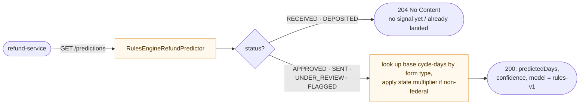
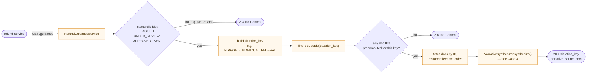
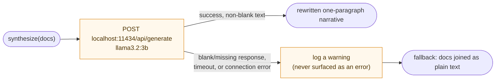

# ai-service

Stateless prediction + RAG guidance. Internal only — not called directly by the client, only
by refund-service. Doesn't know who's asking, only a form type, jurisdiction, and IRS status.

Port: **8083** · no auth (internal-only, not exposed to the client)

## Responsibilities

- **Prediction**: estimates refund timing from a deterministic rules engine keyed on
  form type / jurisdiction / IRS status (`RulesEngineRefundPredictor`).
- **Guidance**: retrieves the top pre-ranked docs for a `situation_key` (deterministic lookup
  against `refund_guidance_situations`, no live vector search at request time — ranking is
  precomputed offline, see [`ml/rag/`](../ml/rag)), then rewrites them into one plain-English
  paragraph using a local **Ollama** model (`llama3.2:3b`), with a safe fallback to plain
  concatenation if Ollama is slow, down, or returns nothing usable.
- Both are pure lookups — same inputs, same output, no session state.

## API

| Method | Path | Description |
|---|---|---|
| GET | `/api/v1/predictions?formType=&jurisdiction=&irsStatus=` | Refund-timing estimate + confidence |
| GET | `/api/v1/guidance?formType=&jurisdiction=&irsStatus=` | Narrative guidance + source docs |

Both return `204 No Content` when nothing applies (e.g. status already `DEPOSITED`).

## Flows

One diagram per case — including the branches inside each one, not just the happy path.

**Case 1 — Refund-timing prediction**



**Case 2 — RAG guidance retrieval**



**Case 3 — Ollama narrative synthesis (inside Case 2)**



## Config (`application.yml`)

| Key | Purpose |
|---|---|
| `ollama.base-url` / `ollama.model` | Local Ollama endpoint + model for narrative generation |
| `spring.datasource.*` | Postgres + pgvector (`refund_guidance_docs`, shared with auth/taxpayer-service) |

## Run

```bash
ollama pull llama3.2:3b && ollama serve   # if not already running
./gradlew :ai-service:bootRun
```

Guidance responses still work without Ollama running — they just fall back to concatenated
doc text instead of a generated paragraph.

## Test

```bash
./gradlew :ai-service:test   # 98% JaCoCo gate
```

## Key terms

- **RAG (Retrieval-Augmented Generation)** — the overall shape of the guidance flow: retrieve
  relevant documents first, then have an LLM turn them into prose, so the model explains real
  retrieved content instead of inventing an answer from nothing.
- **pgvector** — a Postgres extension for storing and querying embedding vectors. It holds the
  guidance-doc corpus, though retrieval at request time is a deterministic `situation_key`
  lookup, not a live vector similarity search — ranking is precomputed offline (see
  [`ml/rag/`](../ml/rag)).
- **situation_key** — a deterministic key built from form type + jurisdiction + IRS status
  (e.g. `FLAGGED_INDIVIDUAL_FEDERAL`), used to look up which docs apply. Same inputs always
  produce the same key and the same docs — there's no per-request ranking variance.
- **Ollama** — a local LLM runtime (`llama3.2:3b`) this service calls to rewrite retrieved
  docs into one plain-English paragraph. If it's slow, down, or returns nothing usable, the
  response falls back to the docs concatenated as plain text instead.
- **Rules engine** — the refund-timing predictor (`RulesEngineRefundPredictor`) is a
  deterministic lookup table keyed on form type/jurisdiction/status, not a trained ML model.
